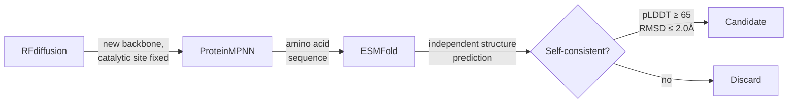

# The Biological Compiler

An AI pipeline that designs candidate enzymes. It scaffolds new protein backbones around a real catalytic site, then checks with a second, independent model whether the resulting sequence actually folds the way it was designed to. The eventual target is PFAS ("forever chemicals"). The current target is a real but non-PFAS stand-in. Reasons below.



## The problem

PFAS contamination is expensive, and getting more expensive. The EPA's 2024 drinking water rule sets enforceable limits (4.0 ppt for PFOA and PFOS) with compliance required by 2029. Real cost estimates already exist: wastewater treatment across affected industries is projected at $3 billion a year, healthcare costs tied to PFAS-linked disease exceed $62 billion, and settlements are already landing (one paper mill paid $11.9 million for historical pollution; see `research/pfas_market.md` for sources). There's no biological solution deployed at scale. Every verified competitor found so far (`research/competitive_landscape.md`) does physical or chemical treatment: filtration, adsorption, supercritical water oxidation. None of them are trying to evolve or design an enzyme that just breaks the bond.

## What's actually been built

A working pipeline, RFdiffusion → ProteinMPNN → ESMFold, running end to end on a single RTX 5090.

1. RFdiffusion generates a new protein backbone that scaffolds a fixed 3-residue catalytic site.
2. ProteinMPNN designs an amino acid sequence for that backbone. The catalytic residues stay fixed so they don't get mutated away.
3. ESMFold, a separate model that never sees RFdiffusion's intended structure, predicts what shape that sequence would actually fold into, from sequence alone.
4. If ESMFold's independent prediction agrees with what was designed, especially at the catalytic site, that's a real self-consistency signal.

This ran twice at scale: 100 backbones, then 300 more. 3,600 sequences total evaluated, and 1,253 passed a real bar (pLDDT ≥ 65, active-site RMSD ≤ 2.0 Å after structural alignment). Those got curated down to 30 candidates, capped per backbone so a handful of lucky designs couldn't dominate the list. Every one of the 30 is sub-angstrom on active-site RMSD (0.47–0.75 Å), pLDDT 70.6–83.9. Full data lives in `data/shortlist/`.


## The gap

Nobody's building the full stack here. There are protein-design tool companies (Baker lab spinouts, various RFdiffusion-adjacent platforms), and there are PFAS remediation product companies doing physical or chemical treatment (see above). Nothing found so far does "generate candidate enzymes specifically for PFAS chemistry, end to end, and get them into a real assay." That's the actual gap. Not because it's technically impossible; this pipeline shows the mechanics work. It's because the work sits between two worlds that don't usually talk to each other.

## What's next, and it isn't more software

The pipeline works. More GPU time produces more candidates at roughly the same pass rate, which is diminishing returns without a better target or a way to actually test what already exists. The real bottleneck is validation: getting even one of these 30 sequences expressed and run through a fluoride-release assay. Everything else is secondary until that happens. `outreach/` has the PI shortlist and the actual email that went out, real names and real affiliations, sent to Peter Jaffé and Lawrence Wackett on 2026-08-15.

## Raw notes, the honest caveats

- **The target isn't PFAS.** The pipeline scaffolds around fluoroacetate dehalogenase (FAcD, PDB 1Y37). Its real catalytic residues (Asp104, Asp128, His271) were verified directly against the downloaded structure file, not just an annotation. FAcD's native substrate is fluoroacetate: one C–F bond next to a carboxylate. Real PFAS chains carry many C–F bonds on an otherwise chemically inert backbone, which is mechanistically much harder to break. FAcD was chosen because it's the best-characterized natural C–F bond-cleaving enzyme with a public structure, and because haloacid dehalogenases (its family) are explicitly named as a candidate family in the PFAS-engineering review literature. Not because it's PFAS-relevant on its own.
- **A real PFAS-active gene exists, and it can't be used yet.** `rdhA`, from *Acidimicrobium* sp. strain A6, was shown by gene-knockout experiments (Jaffé et al., 2024) to actually drive PFOA/PFOS defluorination in a living organism. As of this writing it has no public sequence or structure anywhere checked: not UniProt, not NCBI Protein, not NCBI Assembly, not AlphaFold DB (which is built from UniProt entries, so no UniProt hit means no model either). Worth rechecking periodically.
- **Self-consistency isn't activity.** None of the 30 candidates has been synthesized. Nothing has touched a real fluorine-containing molecule. Structure-prediction agreement is a real, standard first filter in computational enzyme design. It is not evidence that anything works.
- **The "15+ companies" and "$132B" figures from an earlier draft of this brief got dropped.** Neither could be verified. What's in `research/` instead is a shorter list of things actually checked, with sources attached.
- **No wet lab partner is lined up yet.** That's the actual next step, not a new pipeline feature.

## Repo layout

```
pipeline/       the actual working code: RFdiffusion setup, ProteinMPNN wrapper,
                ESMFold filter, RMSD scoring, curation, orchestration, Dockerfile
data/shortlist/ the 30 real candidates: manifest, FASTA, predicted structures
research/       market data, competitor list, enzyme science notes, MCP setup,
                everything sourced, nothing invented
outreach/       PI shortlist and the actual email that was sent
```
