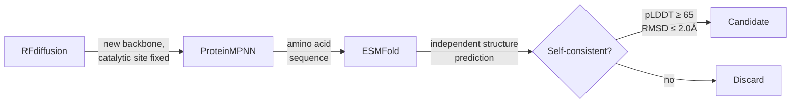
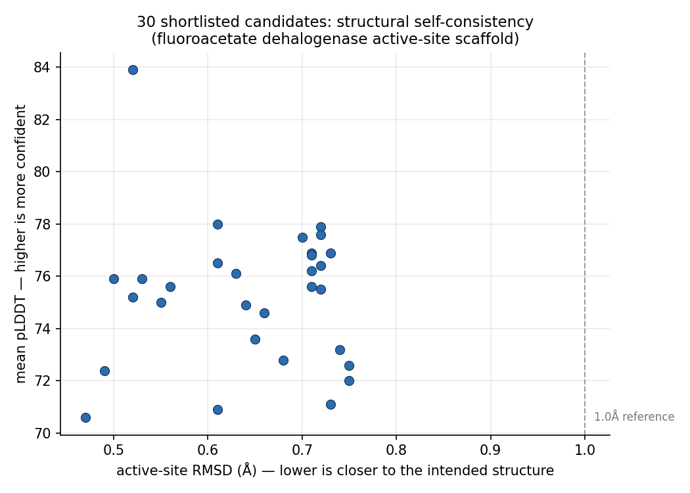

# The Biological Compiler

An AI pipeline that designs candidate enzymes. It scaffolds new protein backbones around a real catalytic site, then checks with a second, independent model whether the resulting sequence actually folds the way it was designed to. The eventual target is PFAS ("forever chemicals"). The current target is a real but non-PFAS stand-in. Reasons below.



## The problem

PFAS contamination is expensive, and getting more expensive. The EPA's 2024 drinking water rule sets enforceable limits (4.0 ppt for PFOA and PFOS) with compliance required by 2029. Real cost estimates already exist: wastewater treatment across affected industries is projected at $3 billion a year, healthcare costs tied to PFAS-linked disease exceed $62 billion, and settlements are already landing (one paper mill paid $11.9 million for historical pollution; see `research/pfas_market.md` for sources). There's no biological solution deployed at scale. Every verified competitor found so far (`research/competitive_landscape.md`) does physical or chemical treatment: filtration, adsorption, supercritical water oxidation. None of them are trying to evolve or design an enzyme that just breaks the bond.

## What's actually been built

A working pipeline, RFdiffusion → ProteinMPNN → ESMFold, running end to end on a single RTX 5090.

1. RFdiffusion generates a new protein backbone that scaffolds a fixed 3-residue catalytic site.
2. ProteinMPNN designs an amino acid sequence for that backbone. The catalytic residues stay fixed so they don't get mutated away.
3. ESMFold, a separate model that never sees RFdiffusion's intended structure, predicts what shape that sequence would actually fold into, from sequence alone.
4. If ESMFold's independent prediction agrees with what was designed, especially at the catalytic site, that's a real self-consistency signal.

This ran twice at scale: 100 backbones, then 300 more. 3,600 sequences total evaluated, and 1,253 passed a real bar (pLDDT ≥ 65, active-site RMSD ≤ 2.0 Å after structural alignment). Those got curated down to 30 candidates, capped per backbone so a handful of lucky designs couldn't dominate the list. Every one of the 30 is sub-angstrom on active-site RMSD (0.47–0.75 Å), pLDDT 70.6–83.9. Full data lives in `data/shortlist/`.



A second, independent check followed: 100 ps of real molecular dynamics (OpenMM, Amber14, implicit solvent) on all 30 candidates, measuring how much each structure actually drifts under physics rather than just what a second AI model predicts. 29/30 held overall structural stability under 2.0 Å, 23/30 held active-site geometry under 1.0 Å. Method and full caveats in `research/md_relaxation.md`.

A third check asked a different question: does a real substrate molecule actually fit the designed pocket. DiffDock docking of all 30 relaxed candidates against fluoroacetate (FAcD's real substrate) and against PFOA/PFOS (the actual PFAS target) found exactly what the target-mismatch caveat below predicts: 9/30 dock fluoroacetate at high confidence, 0/30 dock either PFOA or PFOS at high confidence. That's not a disappointing result, it's the expected one, now measured instead of assumed. Full numbers in `research/diffdock_results.md`.

A fourth check used a second, architecturally unrelated structure-prediction model (Chai-1, an AlphaFold3-class diffusion model, not a language-model-based folder like ESMFold) to independently re-fold all 30 sequences. 30/30 came back high-confidence (pTM > 0.7, mean 0.887) -- a different method arriving at the same answer as ESMFold did, which rules out that agreement being some ESMFold-specific artifact. Full numbers in `research/chai1_results.md`.

A fifth run tried a genuinely different real target: haloalkane dehalogenase (DhlA, PDB 2HAD) instead of FAcD, on the hypothesis that its unactivated-alkyl-halide-in-a-hydrophobic-pocket mechanism might be geometrically closer to a PFAS chain than FAcD's carboxylate-adjacent single-F-bond chemistry is. Full pipeline, 200 backbones, unattended. Chai-1 confidence and MD stability both matched FAcD's numbers almost exactly, but DiffDock came back 0/30 high-confidence for DhlA's *own native substrate*, not just for PFAS -- a different failure mode than FAcD's clean "binds its own substrate, doesn't bind PFAS" result. A follow-up rebuilt the scaffold with DhlA's actual verified binding-pocket residues (two chloride-binding tryptophans, found via UniProt) instead of just the catalytic triad, on the theory that three residues alone hadn't been enough. Same result: still 0/4 high-confidence for the native substrate. Two independent, reproducible negative results on the same target -- this specific scaffolding method doesn't currently work for DhlA, with either recipe. The original hypothesis about haloalkane dehalogenases remains genuinely untested, not refuted. Full writeup in `research/dhla_second_target.md`.

## A different application: drug repurposing and de novo binder design against a real AMR target

The same validated DiffDock infrastructure generalizes past this repo's PFAS project. Two runs against **NDM-1** (New Delhi metallo-β-lactamase-1, PDB 4EYL), a WHO-priority antimicrobial-resistance target that hydrolyzes carbapenem antibiotics:

**Repurposing screen, expanded to 32 real FDA-approved drugs** (up from an initial 13), each verified via PubChem, including known β-lactamase inhibitors, metal chelators, and a positive control (meropenem, the enzyme's own substrate, co-crystallized in the target structure). Two compounds (clavulanic acid 0.14, clioquinol 0.02) crossed into DiffDock's high-confidence band -- and both come with a specific, honest caveat, not a "hit" headline: clavulanic acid's real mechanism (serine β-lactamase inhibition) is well-established as ineffective against metallo-β-lactamases like NDM-1, so this is very likely a mechanism-blind false positive, not a lead. The positive control itself (meropenem) only scored moderate confidence, which recalibrates how much weight any of these bands deserve. Full results and honest interpretation in `research/ndm1_drug_repurposing.md`.

**De novo binder design**, a different and more ambitious method: RFdiffusion's protein-protein-interaction mode generates new binder backbones directly against NDM-1's dizinc active site (hotspot-guided on the real, UniProt-verified zinc-coordinating residues), ProteinMPNN designs each binder's sequence with the target chain held completely fixed, and Chai-1 folds the resulting complex to get a real interface-confidence score (ipTM) -- a fundamentally different question than repurposing: not "does an existing drug happen to fit," but "can a new protein be designed to bind this target at all." Results in progress; will be reported honestly regardless of outcome, same standard as every other result in this repo.

## The gap

Nobody's building the full stack here. There are protein-design tool companies (Baker lab spinouts, various RFdiffusion-adjacent platforms), and there are PFAS remediation product companies doing physical or chemical treatment (see above). Nothing found so far does "generate candidate enzymes specifically for PFAS chemistry, end to end, and get them into a real assay." That's the actual gap. Not because it's technically impossible; this pipeline shows the mechanics work. It's because the work sits between two worlds that don't usually talk to each other.

## What's next, and it isn't more software

The pipeline works. More GPU time produces more candidates at roughly the same pass rate, which is diminishing returns without a better target or a way to actually test what already exists. The real bottleneck is validation: getting even one of these 30 sequences expressed and run through a fluoride-release assay. Everything else is secondary until that happens. `outreach/` has the PI shortlist and the actual email that went out, real names and real affiliations, sent to Peter Jaffé and Lawrence Wackett on 2026-08-15.

## Raw notes, the honest caveats

- **The target isn't PFAS, and now there's docking evidence for exactly that.** The pipeline scaffolds around fluoroacetate dehalogenase (FAcD, PDB 1Y37). Its real catalytic residues (Asp104, Asp128, His271) were verified directly against the downloaded structure file, not just an annotation. FAcD's native substrate is fluoroacetate: one C–F bond next to a carboxylate. Real PFAS chains carry many C–F bonds on an otherwise chemically inert backbone, which is mechanistically much harder to break. FAcD was chosen because it's the best-characterized natural C–F bond-cleaving enzyme with a public structure, and because haloacid dehalogenases (its family) are explicitly named as a candidate family in the PFAS-engineering review literature, not because it's PFAS-relevant on its own. DiffDock docking now confirms this directly: fluoroacetate docks at high confidence in 9/30 candidates, PFOA and PFOS dock at high confidence in 0/30. See `research/diffdock_results.md`.
- **A real PFAS-active gene exists, and it can't be used yet.** `rdhA`, from *Acidimicrobium* sp. strain A6, was shown by gene-knockout experiments (Jaffé et al., 2024) to actually drive PFOA/PFOS defluorination in a living organism. As of this writing it has no public sequence or structure anywhere checked: not UniProt, not NCBI Protein, not NCBI Assembly, not AlphaFold DB (which is built from UniProt entries, so no UniProt hit means no model either). Worth rechecking periodically.
- **Self-consistency, even with an MD check added, still isn't activity.** None of the 30 candidates has been synthesized. Nothing has touched a real fluorine-containing molecule. Structure-prediction agreement and short-timescale MD stability are real, standard early filters in computational enzyme design. Neither is evidence that anything works.
- **The "15+ companies" and "$132B" figures from an earlier draft of this brief got dropped.** Neither could be verified. What's in `research/` instead is a shorter list of things actually checked, with sources attached.
- **No wet lab partner is lined up yet.** That's the actual next step, not a new pipeline feature.

## Repo layout

```
pipeline/          the actual working code: RFdiffusion setup, ProteinMPNN
                    wrapper, ESMFold filter, RMSD scoring, curation, MD
                    relaxation, DiffDock docking, Chai-1 folding,
                    orchestration, Dockerfile
data/shortlist/     the 30 real FAcD candidates: manifest, FASTA, predicted
                    structures, relaxed structures + MD results, docking
                    results, Chai-1 results
data/dhla_shortlist/ the second-target (DhlA) run: same full validation stack,
                    ambiguous result, see research/dhla_second_target.md
research/           market data, competitor list, enzyme science notes, MD
                    relaxation / docking / Chai-1 methodology, the DhlA
                    second-target writeup, MCP setup, everything sourced
outreach/           PI shortlist and the actual email that was sent
```
